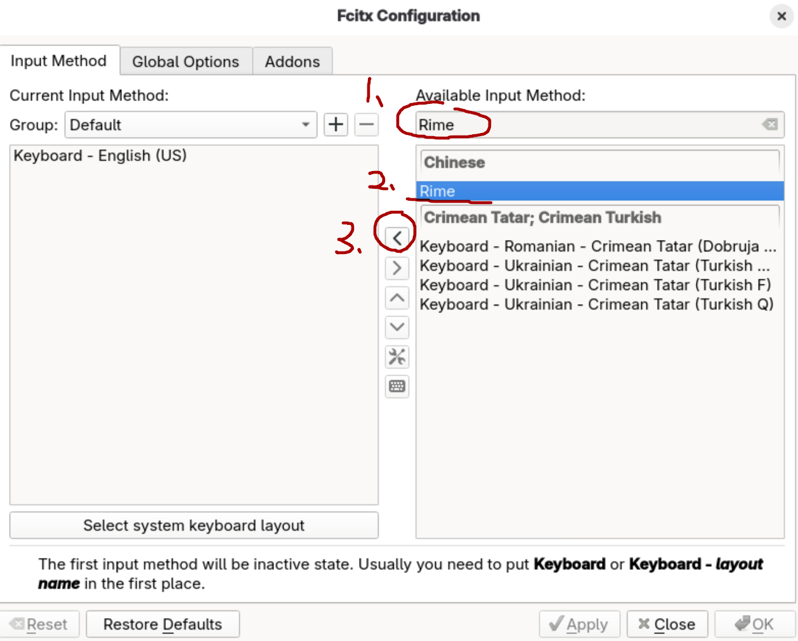
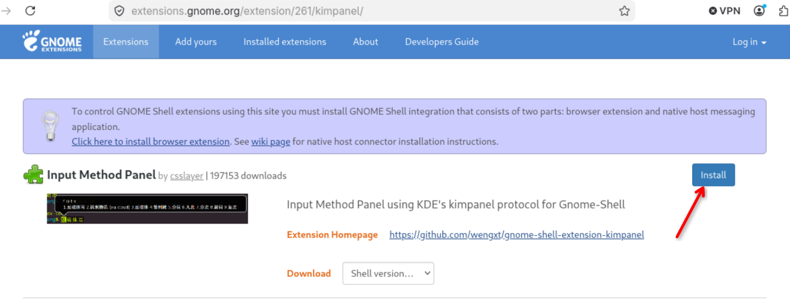
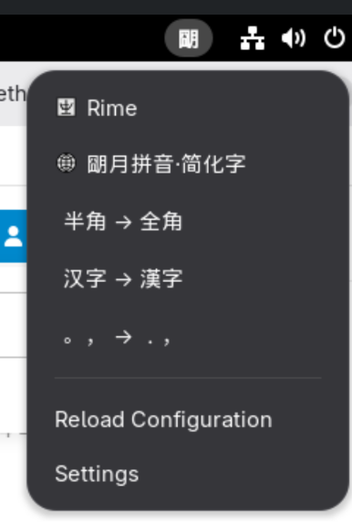

# 安装fcitx5输入法

```bash
sudo dnf install fcitx5 fcitx5-chinese-addons fcitx5-chewing fcitx5-gtk3 fcitx5-gtk4 fcitx5-qt fcitx5-qt6 fcitx5-configtool fcitx5-rime
```

进入fcitx configuration:

搜索Rime, 然后添加到左边, 接着logout重新进入系统



访问gnome的插件市场安装输入法插件 `Input Method Panel` :

[点此链接]: https://extensions.gnome.org/extension/261/kimpanel/	"点此链接"



点击插件，选择简体字



配置完成